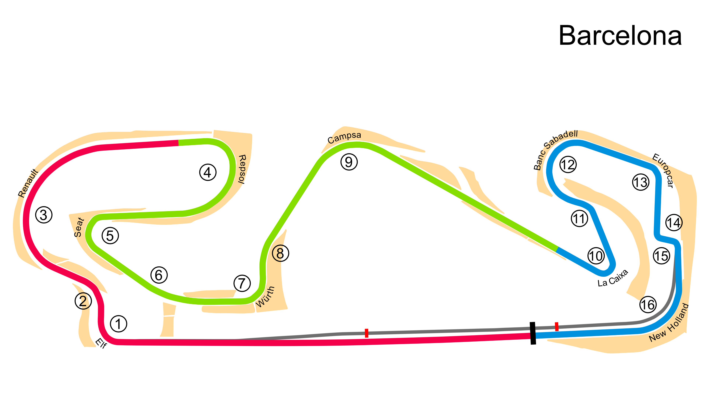

# Barcelona

## Unedited ChatGP Notes
These notes were automatically generated by ChatGPT without any verification.
They should not be trusted. It was simply to fill in some initial content.

This warning will go away once a human reviews and improves this tracks's notes.

## Tips for Every Practice

- Count your corners out loud

## Corner 1: Elf
**Notes:** A tight right-hander that requires heavy braking.

**Braking Reference:** Brake at the 100m board.

**Corner Entry Notes:** Down to 2nd gear.

**Apex Notes:** 

**Exit Notes:** Smooth on throttle.

## Corner 2: Renault
**Notes:** High-speed right-hander.

**Braking Reference:** Light brake.

**Corner Entry Notes:** Maintain speed.

**Apex Notes:** 

**Exit Notes:** Smooth throttle application.

## Corner 3: Repsol
**Notes:** Medium-speed right-hander.

**Braking Reference:** Brake at the 50m board.

**Corner Entry Notes:** Down to 3rd gear.

**Apex Notes:** 

**Exit Notes:** Early on throttle.

## Corner 4: Seat
**Notes:** Medium-speed left-hander.

**Braking Reference:** Brake at the 100m board.

**Corner Entry Notes:** Down to 2nd gear.

**Apex Notes:** 

**Exit Notes:** Early on throttle.

## Corner 5: Campsa
**Notes:** High-speed right-hander.

**Braking Reference:** Slight lift or light brake.

**Corner Entry Notes:** Maintain speed.

**Apex Notes:** 

**Exit Notes:** Early throttle.

## Corner 6: La Caixa
**Notes:** Tight left-hander.

**Braking Reference:** Brake at the 100m board.

**Corner Entry Notes:** Down to 2nd gear.

**Apex Notes:** 

**Exit Notes:** Smooth on throttle.

## Corner 7: Banc Sabadell
**Notes:** Tight right-hander.

**Braking Reference:** Brake at the 50m board.

**Corner Entry Notes:** Down to 2nd gear.

**Apex Notes:** 

**Exit Notes:** Early on throttle.

## Corner 8: Europe Car
**Notes:** High-speed right-hander.

**Braking Reference:** Slight lift or light brake.

**Corner Entry Notes:** Maintain speed.

**Apex Notes:** 

**Exit Notes:** Full throttle.

