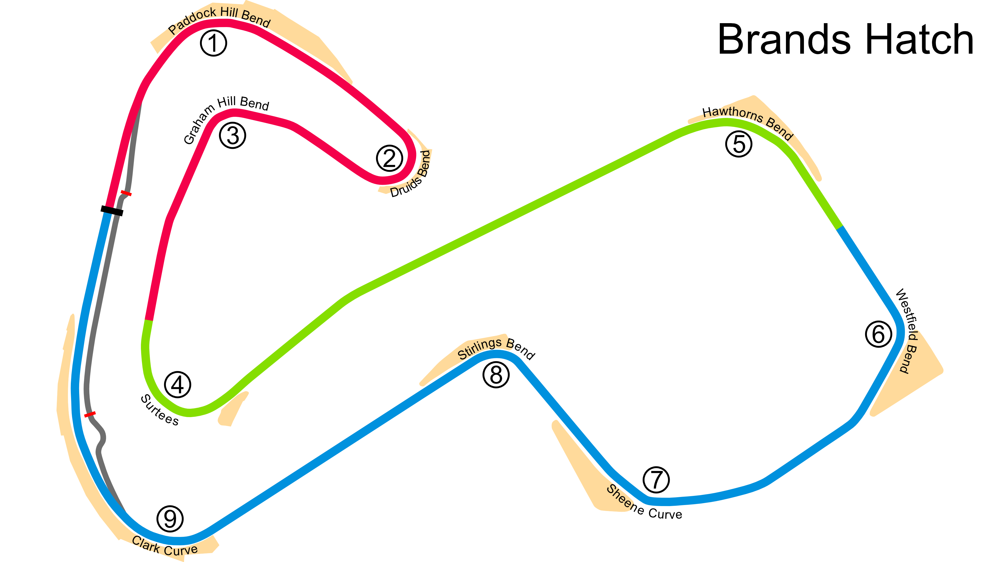

# Brands Hatch

## Unedited ChatGP Notes
These notes were automatically generated by ChatGPT without any verification.
They should not be trusted. It was simply to fill in some initial content.

This warning will go away once a human reviews and improves this tracks's notes.

## Tips for Every Practice

- Count your corners out loud

## Corner 1: Paddock Hill Bend
**Notes:** A fast, downhill right-hander.

**Braking Reference:** Brake at the 50m board.

**Corner Entry Notes:** Down to 3rd gear.

**Apex Notes:** 

**Exit Notes:** Smooth on throttle.

## Corner 2: Druids
**Notes:** A tight uphill hairpin.

**Braking Reference:** Brake at the 100m board.

**Corner Entry Notes:** Down to 2nd gear.

**Apex Notes:** 

**Exit Notes:** Smooth on throttle.

## Corner 3: Graham Hill Bend
**Notes:** Medium-speed left-hander.

**Braking Reference:** Light brake.

**Corner Entry Notes:** Down to 3rd gear.

**Apex Notes:** 

**Exit Notes:** Early on throttle.

## Corner 4: Surtees
**Notes:** High-speed left-hander.

**Braking Reference:** Slight lift.

**Corner Entry Notes:** Maintain speed.

**Apex Notes:** 

**Exit Notes:** Full throttle.

## Corner 5: Hawthorn Bend
**Notes:** High-speed right-hander.

**Braking Reference:** Slight lift or light brake.

**Corner Entry Notes:** Maintain speed.

**Apex Notes:** 

**Exit Notes:** Full throttle.

## Corner 6: Westfield Bend
**Notes:** High-speed right-hander.

**Braking Reference:** Slight lift.

**Corner Entry Notes:** Maintain speed.

**Apex Notes:** 

**Exit Notes:** Full throttle.

## Corner 7: Sheene Curve
**Notes:** High-speed right-hander.

**Braking Reference:** Slight lift.

**Corner Entry Notes:** Maintain speed.

**Apex Notes:** 

**Exit Notes:** Full throttle.

## Corner 8: Stirling's Bend
**Notes:** Medium-speed left-hander.

**Braking Reference:** Light brake.

**Corner Entry Notes:** Down to 3rd gear.

**Apex Notes:** 

**Exit Notes:** Smooth on throttle.

## Corner 9: Clark Curve
**Notes:** Medium-speed right-hander.

**Braking Reference:** Light brake.

**Corner Entry Notes:** Down to 3rd gear.

**Apex Notes:** 

**Exit Notes:** Smooth on throttle.

