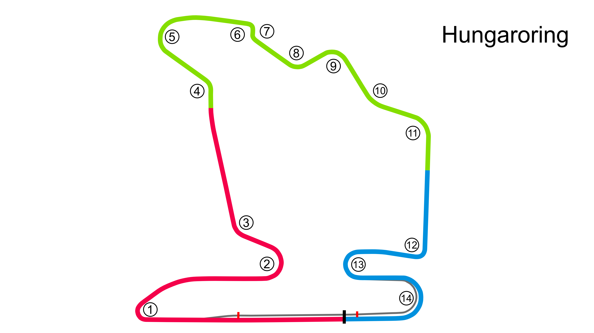

# Hungaroring

## Unedited ChatGP Notes
These notes were automatically generated by ChatGPT without any verification.
They should not be trusted. It was simply to fill in some initial content.

This warning will go away once a human reviews and improves this tracks's notes.

## Tips for Every Practice

- Count your corners out loud

## Corner 1: Turn 1
**Notes:** Tight right-hander.

**Braking Reference:** Brake at the 100m board.

**Corner Entry Notes:** Down to 2nd gear.

**Apex Notes:** 

**Exit Notes:** Smooth on throttle.

## Corner 2: Turn 2
**Notes:** Medium-speed left-hander.

**Braking Reference:** Light brake.

**Corner Entry Notes:** Down to 3rd gear.

**Apex Notes:** 

**Exit Notes:** Early on throttle.

## Corner 3: Turn 3
**Notes:** High-speed right-hander.

**Braking Reference:** No braking needed.

**Corner Entry Notes:** Maintain speed.

**Apex Notes:** 

**Exit Notes:** Full throttle.

## Corner 4: Turn 4
**Notes:** High-speed left-hander.

**Braking Reference:** Slight lift or light brake.

**Corner Entry Notes:** Maintain speed.

**Apex Notes:** 

**Exit Notes:** Early throttle.

## Corner 5: Turn 5
**Notes:** Medium-speed right-hander.

**Braking Reference:** Light brake.

**Corner Entry Notes:** Down to 3rd gear.

**Apex Notes:** 

**Exit Notes:** Smooth on throttle.

## Corner 6: Turn 6
**Notes:** Tight left-right chicane.

**Braking Reference:** Brake at the 100m board.

**Corner Entry Notes:** Down to 2nd gear.

**Apex Notes:** 

**Exit Notes:** Smooth transition.

## Corner 7: Turn 7
**Notes:** Medium-speed left-hander.

**Braking Reference:** Light brake.

**Corner Entry Notes:** Down to 3rd gear.

**Apex Notes:** 

**Exit Notes:** Early on throttle.

## Corner 8: Turn 8
**Notes:** Medium-speed right-hander.

**Braking Reference:** Light brake.

**Corner Entry Notes:** Down to 3rd gear.

**Apex Notes:** 

**Exit Notes:** Smooth on throttle.

## Corner 9: Turn 9
**Notes:** Medium-speed left-hander.

**Braking Reference:** Light brake.

**Corner Entry Notes:** Down to 3rd gear.

**Apex Notes:** 

**Exit Notes:** Early on throttle.

## Corner 10: Turn 10
**Notes:** Medium-speed right-hander.

**Braking Reference:** Light brake.

**Corner Entry Notes:** Down to 3rd gear.

**Apex Notes:** 

**Exit Notes:** Smooth on throttle.

## Corner 11: Turn 11
**Notes:** High-speed right-hander.

**Braking Reference:** Slight lift or light brake.

**Corner Entry Notes:** Maintain speed.

**Apex Notes:** 

**Exit Notes:** Full throttle.

## Corner 12: Turn 12
**Notes:** Tight left-hander.

**Braking Reference:** Brake at the 100m board.

**Corner Entry Notes:** Down to 2nd gear.

**Apex Notes:** 

**Exit Notes:** Smooth on throttle.

## Corner 13: Turn 13
**Notes:** Medium-speed right-hander.

**Braking Reference:** Light brake.

**Corner Entry Notes:** Down to 3rd gear.

**Apex Notes:** 

**Exit Notes:** Early on throttle.

## Corner 14: Turn 14
**Notes:** Tight right-hander.

**Braking Reference:** Brake at the 100m board.

**Corner Entry Notes:** Down to 2nd gear.

**Apex Notes:** 

**Exit Notes:** Smooth on throttle.

