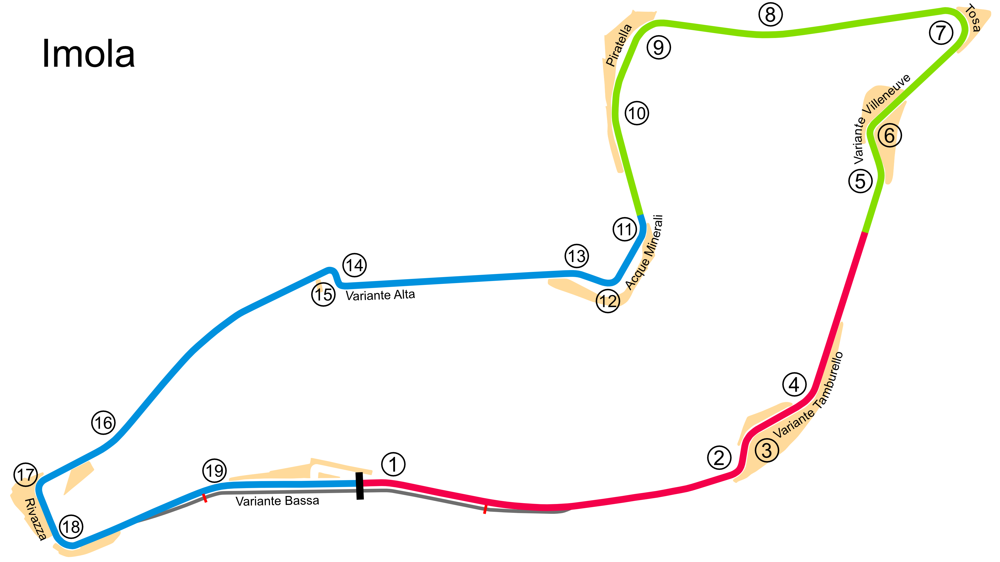

# Imola

## Unedited ChatGP Notes
These notes were automatically generated by ChatGPT without any verification.
They should not be trusted. It was simply to fill in some initial content.

This warning will go away once a human reviews and improves this tracks's notes.

## Tips for Every Practice

- Count your corners out loud

## Corner 1: Tamburello
**Notes:** High-speed chicane.

**Braking Reference:** Brake at the 100m board.

**Corner Entry Notes:** Down to 3rd gear.

**Apex Notes:** 

**Exit Notes:** Smooth on the throttle.

## Corner 2: Villeneuve
**Notes:** Medium-speed chicane.

**Braking Reference:** Brake at the 50m board.

**Corner Entry Notes:** Down to 3rd gear.

**Apex Notes:** 

**Exit Notes:** Careful on the throttle.

## Corner 3: Tosa
**Notes:** Tight left-hander.

**Braking Reference:** Brake at the 100m board.

**Corner Entry Notes:** Down to 2nd gear.

**Apex Notes:** 

**Exit Notes:** Early on the throttle.

## Corner 4: Piratella
**Notes:** Fast left-hander.

**Braking Reference:** Light brake before entry.

**Corner Entry Notes:** Down to 4th gear.

**Apex Notes:** 

**Exit Notes:** Full throttle through the turn.

## Corner 5: Acque Minerali
**Notes:** Challenging right-hander.

**Braking Reference:** Brake at the 100m board.

**Corner Entry Notes:** Down to 2nd gear.

**Apex Notes:** 

**Exit Notes:** Smooth on the power.

## Corner 6: Variante Alta
**Notes:** Tight chicane.

**Braking Reference:** Brake at the 100m board.

**Corner Entry Notes:** Down to 2nd gear.

**Apex Notes:** 

**Exit Notes:** Quick on the throttle.

## Corner 7: Rivazza
**Notes:** Double left-hander.

**Braking Reference:** Brake at the 100m board.

**Corner Entry Notes:** Down to 3rd gear.

**Apex Notes:** 

**Exit Notes:** Full throttle as early as possible.

