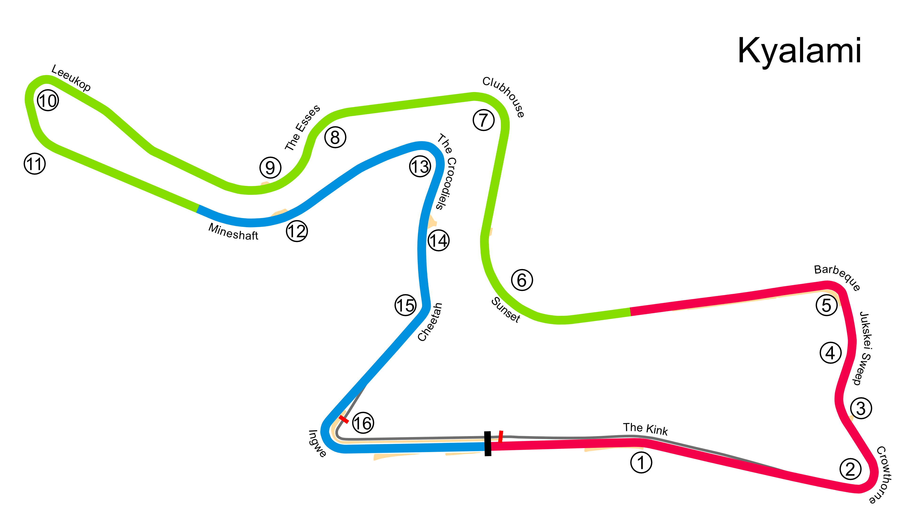

# Kyalami

## Unedited ChatGP Notes
These notes were automatically generated by ChatGPT without any verification.
They should not be trusted. It was simply to fill in some initial content.

This warning will go away once a human reviews and improves this tracks's notes.

## Tips for Every Practice

- Count your corners out loud

## Corner 1: Crowthorne
**Notes:** Tight right-hander.

**Braking Reference:** Brake at the 100m board.

**Corner Entry Notes:** Down to 2nd gear.

**Apex Notes:** 

**Exit Notes:** Smooth on throttle.

## Corner 2: Jukskei Sweep
**Notes:** High-speed left-hander.

**Braking Reference:** Slight lift or light brake.

**Corner Entry Notes:** Maintain speed.

**Apex Notes:** 

**Exit Notes:** Full throttle.

## Corner 3: Barbeque Bend
**Notes:** Medium-speed right-hander.

**Braking Reference:** Light brake.

**Corner Entry Notes:** Down to 3rd gear.

**Apex Notes:** 

**Exit Notes:** Smooth on throttle.

## Corner 4: Sunset
**Notes:** High-speed right-hander.

**Braking Reference:** Slight lift.

**Corner Entry Notes:** Maintain speed.

**Apex Notes:** 

**Exit Notes:** Full throttle.

## Corner 5: Clubhouse Bend
**Notes:** Medium-speed right-hander.

**Braking Reference:** Light brake.

**Corner Entry Notes:** Down to 3rd gear.

**Apex Notes:** 

**Exit Notes:** Early on throttle.

## Corner 6: The Esses
**Notes:** Series of left-right turns.

**Braking Reference:** Light brake.

**Corner Entry Notes:** Maintain speed.

**Apex Notes:** 

**Exit Notes:** Smooth transition.

## Corner 7: Leeukop
**Notes:** Tight right-hander.

**Braking Reference:** Brake at the 100m board.

**Corner Entry Notes:** Down to 2nd gear.

**Apex Notes:** 

**Exit Notes:** Smooth on throttle.

## Corner 8: Mineshaft
**Notes:** High-speed left-hander.

**Braking Reference:** Slight lift.

**Corner Entry Notes:** Maintain speed.

**Apex Notes:** 

**Exit Notes:** Full throttle.

## Corner 9: The Crocodiles
**Notes:** Medium-speed right-hander.

**Braking Reference:** Light brake.

**Corner Entry Notes:** Down to 3rd gear.

**Apex Notes:** 

**Exit Notes:** Smooth on throttle.

## Corner 10: Cheetah
**Notes:** High-speed left-hander.

**Braking Reference:** Slight lift.

**Corner Entry Notes:** Maintain speed.

**Apex Notes:** 

**Exit Notes:** Full throttle.

## Corner 11: Ingwe
**Notes:** Tight right-hander.

**Braking Reference:** Brake at the 100m board.

**Corner Entry Notes:** Down to 2nd gear.

**Apex Notes:** 

**Exit Notes:** Smooth on throttle.

