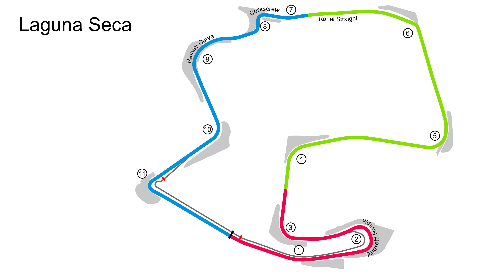

# Laguna Seca

## Unedited ChatGP Notes
These notes were automatically generated by ChatGPT without any verification.
They should not be trusted. It was simply to fill in some initial content.

This warning will go away once a human reviews and improves this tracks's notes.

## Tips for Every Practice

- Count your corners out loud

## Corner 1: Andretti Hairpin
**Notes:** Double-apex left-hander.

**Braking Reference:** Brake at the 100m board.

**Corner Entry Notes:** Down to 2nd gear.

**Apex Notes:** 

**Exit Notes:** Smooth on throttle.

## Corner 2: Turn 3
**Notes:** Medium-speed right-hander.

**Braking Reference:** Light brake.

**Corner Entry Notes:** Down to 3rd gear.

**Apex Notes:** 

**Exit Notes:** Early on throttle.

## Corner 3: Turn 4
**Notes:** Medium-speed right-hander.

**Braking Reference:** Light brake.

**Corner Entry Notes:** Down to 3rd gear.

**Apex Notes:** 

**Exit Notes:** Smooth on throttle.

## Corner 4: Turn 5
**Notes:** Medium-speed left-hander.

**Braking Reference:** Light brake.

**Corner Entry Notes:** Down to 3rd gear.

**Apex Notes:** 

**Exit Notes:** Early on throttle.

## Corner 5: Turn 6
**Notes:** High-speed left-hander.

**Braking Reference:** Slight lift.

**Corner Entry Notes:** Maintain speed.

**Apex Notes:** 

**Exit Notes:** Full throttle.

## Corner 6: The Corkscrew
**Notes:** Famous downhill left-right chicane.

**Braking Reference:** Brake at the 100m board.

**Corner Entry Notes:** Down to 2nd gear.

**Apex Notes:** 

**Exit Notes:** Smooth transition.

## Corner 7: Rainey Curve
**Notes:** High-speed left-hander.

**Braking Reference:** Slight lift.

**Corner Entry Notes:** Maintain speed.

**Apex Notes:** 

**Exit Notes:** Full throttle.

## Corner 8: Turn 10
**Notes:** Medium-speed right-hander.

**Braking Reference:** Light brake.

**Corner Entry Notes:** Down to 3rd gear.

**Apex Notes:** 

**Exit Notes:** Smooth on throttle.

## Corner 9: Turn 11
**Notes:** Tight left-hander.

**Braking Reference:** Brake at the 100m board.

**Corner Entry Notes:** Down to 2nd gear.

**Apex Notes:** 

**Exit Notes:** Smooth on throttle.

