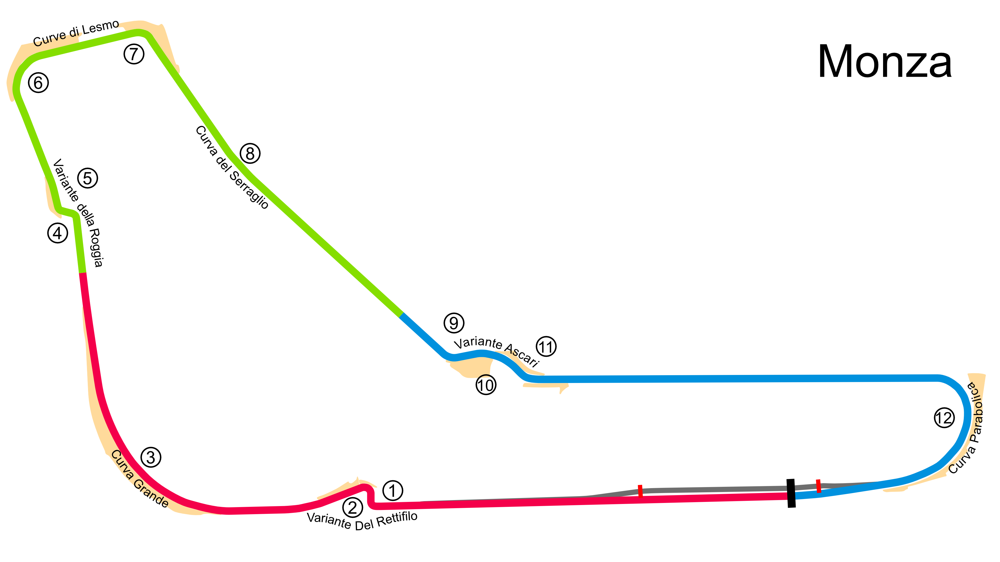

# Monza

## Unedited ChatGP Notes
These notes were automatically generated by ChatGPT without any verification.
They should not be trusted. It was simply to fill in some initial content.

This warning will go away once a human reviews and improves this tracks's notes.

## Tips for Every Practice

- Count your corners out loud

## Corner 1: Variante del Rettifilo
**Notes:** A tight chicane that requires heavy braking.

**Braking Reference:** Brake hard at the 150m board.

**Corner Entry Notes:** Slow down to 2nd gear.

**Apex Notes:** 

**Exit Notes:** Careful on throttle, aim for a clean exit.

## Corner 2: Curva Grande
**Notes:** High-speed right-hand corner.

**Braking Reference:** No braking needed.

**Corner Entry Notes:** Stay to the left.

**Apex Notes:** 

**Exit Notes:** Smooth on the throttle.

## Corner 3: Variante della Roggia
**Notes:** Another chicane, tricky and technical.

**Braking Reference:** Brake at the 150m board.

**Corner Entry Notes:** Down to 2nd gear.

**Apex Notes:** 

**Exit Notes:** Keep the car stable.

## Corner 4: Lesmo 1
**Notes:** Medium-speed right-hander.

**Braking Reference:** Brake at the 50m board.

**Corner Entry Notes:** Down to 3rd gear.

**Apex Notes:** 

**Exit Notes:** Early on the throttle.

## Corner 5: Lesmo 2
**Notes:** Slightly faster than Lesmo 1.

**Braking Reference:** Light brake at the 50m board.

**Corner Entry Notes:** Down to 3rd gear.

**Apex Notes:** 

**Exit Notes:** Focus on a good exit onto the straight.

## Corner 6: Ascari
**Notes:** A fast and challenging chicane.

**Braking Reference:** Brake at the 100m board.

**Corner Entry Notes:** Down to 4th gear.

**Apex Notes:** 

**Exit Notes:** Smooth transition through each section.

## Corner 7: Parabolica
**Notes:** Long, sweeping right-hander.

**Braking Reference:** Brake at the 100m board.

**Corner Entry Notes:** Down to 3rd gear.

**Apex Notes:** 

**Exit Notes:** Full throttle as early as possible.

