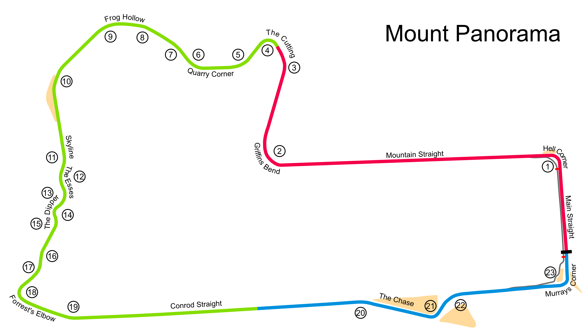

# Mount Panorama

## Unedited ChatGP Notes
These notes were automatically generated by ChatGPT without any verification.
They should not be trusted. It was simply to fill in some initial content.

This warning will go away once a human reviews and improves this tracks's notes.

## Tips for Every Practice

- Count your corners out loud

## Corner 1: Hell Corner
**Notes:** A tight left-hand turn.

**Braking Reference:** Brake at the 100m board.

**Corner Entry Notes:** Slow down to 2nd gear.

**Apex Notes:** 

**Exit Notes:** Use full throttle on exit.

## Corner 2: The Cutting
**Notes:** A steep uphill left-hander.

**Braking Reference:** Brake early and hard.

**Corner Entry Notes:** Slow down to 2nd gear.

**Apex Notes:** 

**Exit Notes:** Smooth on the throttle due to the incline.

## Corner 3: Griffin's Mount
**Notes:** Fast right-hander.

**Braking Reference:** Slight lift before the turn.

**Corner Entry Notes:** Maintain speed.

**Apex Notes:** 

**Exit Notes:** Early throttle.

## Corner 4: Skyline
**Notes:** Tricky downhill section.

**Braking Reference:** Light brake before entry.

**Corner Entry Notes:** Down to 3rd gear.

**Apex Notes:** 

**Exit Notes:** Control the descent.

## Corner 5: Forrest's Elbow
**Notes:** Tight left-hander before the long straight.

**Braking Reference:** Brake hard before the elbow.

**Corner Entry Notes:** Down to 2nd gear.

**Apex Notes:** 

**Exit Notes:** Maximize exit speed onto the straight.

## Corner 6: The Chase
**Notes:** High-speed chicane.

**Braking Reference:** Brake at the 150m board.

**Corner Entry Notes:** Down to 3rd gear.

**Apex Notes:** 

**Exit Notes:** Quick transition through the turns.

