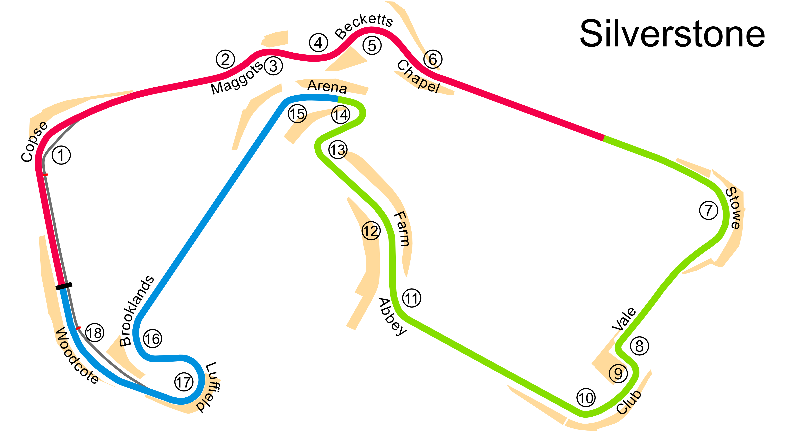

# Silverstone

## Tips for Every Practice

- Count your corners out loud

## Corner 1: Copse
**Notes:** None

**Braking Reference:** Just before the 50

**Corner Entry Notes:** You should have 2 wheels over the left curb, brake and turn in immediatly.

**Apex Notes:** Roll off brakes just before Apex, tires fully over the right curb

**Exit Notes:** Just after apex get back on gas and slide out to left edge.

## Corner 2: Maggots
**Notes:** It's a compound corner/jog. Use the curbs as much as possible

**Braking Reference:** 

**Corner Entry Notes:** Enter from the far right, then use all of left curb. Dab the brakes to come back to right curb.

**Apex Notes:** 

**Exit Notes:** Try to exit tight in the middle of the track, not the left to setup for Beckets

## Corner 3: Maggots
**Notes:** 

**Braking Reference:** 

**Corner Entry Notes:** 

**Apex Notes:** 

**Exit Notes:** 

## Corner 4: Maggots
**Notes:** None

**Braking Reference:** None

**Corner Entry Notes:** None

**Apex Notes:** 

**Exit Notes:** None

## Corner 5: Becketts
**Notes:** None

**Braking Reference:** None

**Corner Entry Notes:** None

**Apex Notes:** 

**Exit Notes:** None

## Corner 6: Chapel
**Notes:** None

**Braking Reference:** None

**Corner Entry Notes:** None

**Apex Notes:** 

**Exit Notes:** Don't use the green run off

## Corner 7: Stowe
**Notes:** None

**Braking Reference:** None

**Corner Entry Notes:** None

**Apex Notes:** 

**Exit Notes:** None

## Corner 8: Vale
**Notes:** None

**Braking Reference:** None

**Corner Entry Notes:** None

**Apex Notes:** 

**Exit Notes:** None

## Corner 9: Club
**Notes:** None

**Braking Reference:** None

**Corner Entry Notes:** None

**Apex Notes:** 

**Exit Notes:** None

## Corner 10: 10
**Notes:** None

**Braking Reference:** None

**Corner Entry Notes:** None

**Apex Notes:** 

**Exit Notes:** None

## Corner 11: Abbey
**Notes:** None

**Braking Reference:** None

**Corner Entry Notes:** None

**Apex Notes:** 

**Exit Notes:** None

## Corner 12: Farm
**Notes:** None

**Braking Reference:** None

**Corner Entry Notes:** None

**Apex Notes:** 

**Exit Notes:** None

## Corner 13: 13
**Notes:** None

**Braking Reference:** None

**Corner Entry Notes:** None

**Apex Notes:** 

**Exit Notes:** None

## Corner 14: Arena
**Notes:** None

**Braking Reference:** None

**Corner Entry Notes:** None

**Apex Notes:** 

**Exit Notes:** None

## Corner 15: 15
**Notes:** None

**Braking Reference:** None

**Corner Entry Notes:** None

**Apex Notes:** 

**Exit Notes:** None

## Corner 16: Brooklands
**Notes:** None

**Braking Reference:** None

**Corner Entry Notes:** None

**Apex Notes:** 

**Exit Notes:** None

## Corner 17: Luffield
**Notes:** None

**Braking Reference:** None

**Corner Entry Notes:** None

**Apex Notes:** 

**Exit Notes:** None

## Corner 18: Woodcote
**Notes:** None

**Braking Reference:** None

**Corner Entry Notes:** None

**Apex Notes:** 

**Exit Notes:** None

