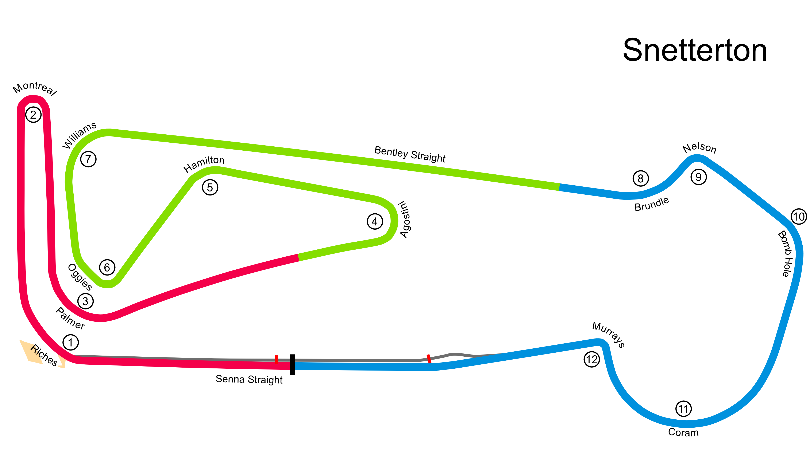

# Snetterton

## Unedited ChatGP Notes
These notes were automatically generated by ChatGPT without any verification.
They should not be trusted. It was simply to fill in some initial content.

This warning will go away once a human reviews and improves this tracks's notes.

## Tips for Every Practice

- Count your corners out loud

## Corner 1: Riches
**Notes:** Fast right-hander.

**Braking Reference:** Slight lift or light brake.

**Corner Entry Notes:** Maintain speed.

**Apex Notes:** 

**Exit Notes:** Full throttle.

## Corner 2: Montreal
**Notes:** Tight right-hander.

**Braking Reference:** Brake at the 100m board.

**Corner Entry Notes:** Down to 2nd gear.

**Apex Notes:** 

**Exit Notes:** Smooth on throttle.

## Corner 3: Palmer
**Notes:** Medium-speed left-hander.

**Braking Reference:** Light brake.

**Corner Entry Notes:** Down to 3rd gear.

**Apex Notes:** 

**Exit Notes:** Early on throttle.

## Corner 4: Agostini
**Notes:** Tight left-hander.

**Braking Reference:** Brake at the 100m board.

**Corner Entry Notes:** Down to 2nd gear.

**Apex Notes:** 

**Exit Notes:** Smooth on throttle.

## Corner 5: Hamilton
**Notes:** Medium-speed left-hander.

**Braking Reference:** Light brake.

**Corner Entry Notes:** Down to 3rd gear.

**Apex Notes:** 

**Exit Notes:** Early on throttle.

## Corner 6: Oggies
**Notes:** Medium-speed right-hander.

**Braking Reference:** Light brake.

**Corner Entry Notes:** Down to 3rd gear.

**Apex Notes:** 

**Exit Notes:** Smooth on throttle.

## Corner 7: Williams
**Notes:** Medium-speed right-hander.

**Braking Reference:** Light brake.

**Corner Entry Notes:** Down to 3rd gear.

**Apex Notes:** 

**Exit Notes:** Smooth on throttle.

## Corner 8: Brundle
**Notes:** Medium-speed left-hander.

**Braking Reference:** Light brake.

**Corner Entry Notes:** Down to 3rd gear.

**Apex Notes:** 

**Exit Notes:** Early on throttle.

## Corner 9: Nelson
**Notes:** Medium-speed right-hander.

**Braking Reference:** Light brake.

**Corner Entry Notes:** Down to 3rd gear.

**Apex Notes:** 

**Exit Notes:** Smooth on throttle.

## Corner 10: Bomb Hole
**Notes:** Medium-speed right-hander.

**Braking Reference:** Light brake.

**Corner Entry Notes:** Down to 3rd gear.

**Apex Notes:** 

**Exit Notes:** Smooth on throttle.

## Corner 11: Coram
**Notes:** Long, fast right-hander.

**Braking Reference:** Slight lift or light brake.

**Corner Entry Notes:** Maintain speed.

**Apex Notes:** 

**Exit Notes:** Full throttle.

## Corner 12: Murrays
**Notes:** Tight left-hander.

**Braking Reference:** Brake at the 100m board.

**Corner Entry Notes:** Down to 2nd gear.

**Apex Notes:** 

**Exit Notes:** Smooth on throttle.

