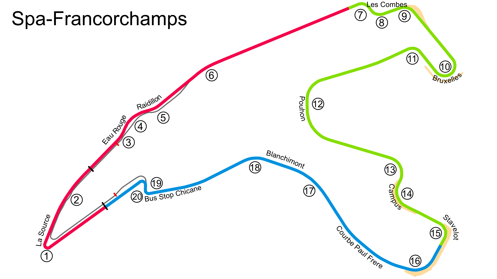

# Spa

## Unedited ChatGP Notes
These notes were automatically generated by ChatGPT without any verification.
They should not be trusted. It was simply to fill in some initial content.

This warning will go away once a human reviews and improves this tracks's notes.

## Tips for Every Practice

- Count your corners out loud

## Corner 1: La Source
**Notes:** A tight hairpin that requires heavy braking.

**Braking Reference:** Brake at the 100m board.

**Corner Entry Notes:** Slow down to 1st gear.

**Apex Notes:** 

**Exit Notes:** Accelerate smoothly out.

## Corner 2: Eau Rouge & Raidillon
**Notes:** A challenging uphill section.

**Braking Reference:** Full throttle through Eau Rouge.

**Corner Entry Notes:** Slight lift if needed.

**Apex Notes:** 

**Exit Notes:** Keep to the right at Raidillon.

## Corner 3: Les Combes
**Notes:** Technical chicane at the end of the Kemmel Straight.

**Braking Reference:** Brake at the 150m board.

**Corner Entry Notes:** Down to 2nd gear.

**Apex Notes:** 

**Exit Notes:** Balance the throttle through the turns.

## Corner 4: Bruxelles
**Notes:** Long, tight right-hander.

**Braking Reference:** Brake at the 100m board.

**Corner Entry Notes:** Down to 2nd gear.

**Apex Notes:** 

**Exit Notes:** Smooth on the power.

## Corner 5: Pouhon
**Notes:** High-speed double left-hander.

**Braking Reference:** Lift off slightly before entry.

**Corner Entry Notes:** No braking needed.

**Apex Notes:** 

**Exit Notes:** Full throttle mid-corner.

## Corner 6: Stavelot
**Notes:** Fast right-hander.

**Braking Reference:** Light brake at the entry.

**Corner Entry Notes:** Down to 4th gear.

**Apex Notes:** 

**Exit Notes:** Carry speed onto the straight.

## Corner 7: Blanchimont
**Notes:** High-speed left-hander.

**Braking Reference:** Flat out if possible.

**Corner Entry Notes:** No braking needed.

**Apex Notes:** 

**Exit Notes:** Hold the line.

