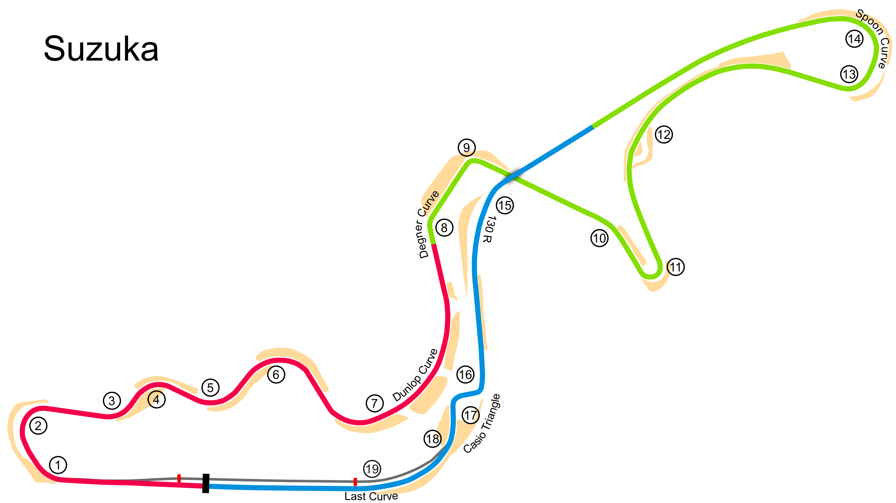

# Suzuka

## Unedited ChatGP Notes
These notes were automatically generated by ChatGPT without any verification.
They should not be trusted. It was simply to fill in some initial content.

This warning will go away once a human reviews and improves this tracks's notes.

## Tips for Every Practice

- Count your corners out loud

## Corner 1: First Curve
**Notes:** High-speed right-hander.

**Braking Reference:** Brake at the 100m board.

**Corner Entry Notes:** Slow down to 3rd gear.

**Apex Notes:** 

**Exit Notes:** Maintain momentum through the exit.

## Corner 2: S Curves
**Notes:** A series of flowing turns.

**Braking Reference:** Enter at 4th gear, feather the throttle.

**Corner Entry Notes:** Maintain a smooth rhythm.

**Apex Notes:** 

**Exit Notes:** Keep a consistent speed.

## Corner 3: Degner 1
**Notes:** Tight right-hander.

**Braking Reference:** Brake hard before the bridge.

**Corner Entry Notes:** Down to 3rd gear.

**Apex Notes:** 

**Exit Notes:** Smooth on the throttle.

## Corner 4: Degner 2
**Notes:** Short, sharp right-hander.

**Braking Reference:** Quick brake before the turn.

**Corner Entry Notes:** Down to 2nd gear.

**Apex Notes:** 

**Exit Notes:** Early throttle.

## Corner 5: Spoon Curve
**Notes:** Long, double-apex left-hander.

**Braking Reference:** Brake at the 100m board.

**Corner Entry Notes:** Down to 3rd gear.

**Apex Notes:** 

**Exit Notes:** Early throttle.

## Corner 6: 130R
**Notes:** High-speed left-hander.

**Braking Reference:** Flat out if possible, slight lift if necessary.

**Corner Entry Notes:** Maintain speed.

**Apex Notes:** 

**Exit Notes:** Hold the racing line.

## Corner 7: Casio Triangle
**Notes:** Tight chicane.

**Braking Reference:** Brake hard at the 150m board.

**Corner Entry Notes:** Down to 2nd gear.

**Apex Notes:** 

**Exit Notes:** Focus on a clean exit.

